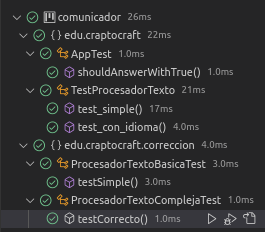

# Comunicador ISP Kata

Repositorio con mi solución a kata propuesto por mi tutor @dfleta para practicar ISP 

- [Uso](#Uso)
- [Pruebas](#Pruebas)


# Uso

Procesamiento de texto simple o complejo:

```
    public void testSimple() {
        Basico procesador = new ProcesadorTextoBasica();

        procesador.nueva("No");
        procesador.nueva("himporta");
        procesador.nueva("la");
        procesador.nueva("hortografia");

        assertEquals("No himporta la hortografia", procesador.texto());

    }

        public void testCorrecto() {
        ProcesadorTextoCompleja procesador = new ProcesadorTextoCompleja();

        procesador.nueva("Tengo");
        procesador.nueva("hambre");

        assertEquals("Tengo hambre", procesador.texto());

        assertTrue(procesador.correcto(Idioma.ES));
    }
```


# Pruebas

Para desarrollar el ejercicio se ha realizado mediante TDD realizando test unitarios.


